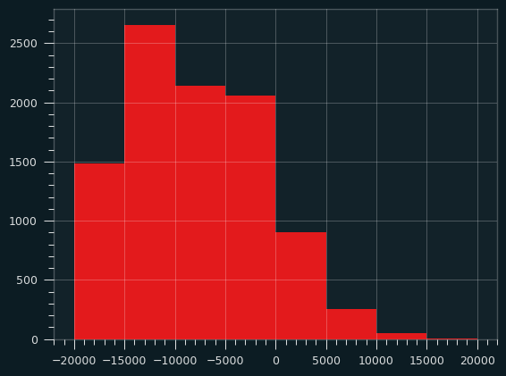

Title: Cool Parlay, Bro
Date: 2025-07-16 10:20
Category: sports betting
Tags: basketball, your parlay sucks

(This is an excerpt from my book about sports gambling. Code and early drafts of some of the chapters can be found at [https://github.com/csdurfee/book](https://github.com/csdurfee/book).)

Sportsbooks have many ways of encouraging people to lose their money as quickly and efficiently as possible. One of the best ways to do this is a type of bet called the parlay. "Parlez" means "to talk" in French, so it's no surprise dudes always want to talk about them online.

The idea behind a parlay is that you can bet on multiple events at once and if they all win, you make a nice profit, otherwise you lose. On a technical level, if the first bet on the parlay wins, the winnings are immediately placed on the second bet in the parlay, if that wins, it rolls over to the third bet, and so on. It's a sequence of bets, with the stakes going up with each bet. The individual bets in the parlay are known as "legs".   

I'm going to keep asking this question: why would they be offering this bet if it was good for you?  Parlays might be more fun, but that just means they found a way to get you to part with your money easier, which sounds like a bad thing.

We can compare different bets by using Expected Value (EV). EV is the weighted average of all the possible outcomes. If the expected value is positive, we will make money over the long run; if it's negative, we will lose money. 

[The traditional payout on a 4 team parlay is 10:1](https://www.vegasinsider.com/parlay-calculator/). What is the expected value of such a play? is it higher or lower than taking the individual bets?

It's easy to grind the math on this one, and see which option is better. I can't say "make us more money" because both types of bets are guaranteed losers without some sort of edge.

Parlays are such a bad type of bet on the surface that to understand them, I have to give a little taste of parlay culture first.

### Nephew Doug
Say you want to place some bets. You just learned about betting on sports, so as a newbie you're trying to learn from experts by listening to gambling podcasts. These guys have been gambling for decades. Surely they must know what's up. Their wisdom will give you the edge for sure. Surely they will keep you from making costly mistakes.

You've listened to Nephew Doug's podcast, and wrote down his Locks of the Week. You're ready to enter them into your betting app, which has been hand-optimized to be as much of a dopamine and money sink as possible.

Because you listen every week, you know Nephew Doug has been burdened by the Gods with the gift of prophecy. Just ask him. He's like a modern day Cassandra, only it's about how the Cowboys are always going to suck. 

Now, the Gods like a little competition. The Olympics were invented as a religious ceremony in their honor, after all. But they're not above making a call from on high to nudge the result a little bit. Yes, Zeus is definitely a Chiefs fan.

So you believe ahead of time Nephew Doug's picks will win 55% of the time. Which way of betting these picks will bring you the most money in the long run?

1) "throw 'em all in a 4 team parlay" like Doug and his buddy Jorts Guy do    
2) randomly choose 3 of Nephew Doug's picks and bet them individually. Don't do anything with the 4th one.

Maybe option 2 seems insane to you. But let's game it out. 

You listen to Nephew Doug, but I don't. My assumption would be this guy is no better than a coin flip -- he only wins 50% of the time, or close to it. Parlays at old school casinos pay at 10:1 and online sportsbooks pay 12.28:1. Let's see how that works out at 10:1 payout, the ones Jorts Guy and Nephew Doug were cutting their teeth on back in the day.

There are two ways to do the comparison. We could bet $100 on the parlay, and compare to putting $25 on each leg. Or we could compare $100 on the parlay to $100 on each leg.

Neither way of comparing is entirely fair, though, because the stakes increase throughout each leg of the parlay. If a gambler bets $100 on a 4 team parlay, they're risking $100 on the first leg. Assuming they keep winning, they're risking $190 on the 2nd leg, $300ish dollars on the 3rd leg, and $600ish dollars on the 4th leg. 

For each leg of the parlay, the gambler should consider the risk of losing out on $600 if they took a 3 team parlay and it won. Risking $100 on the 4 leg parlay is sort of like taking 4 different $600 bets, because each one could cost the gambler that much if it loses.

I will be comparing risking $100 on the parlay versus $25 on each of the legs.

### 7x worse
This difference only matters for bettors with a high degree of skill. For the beginner, who we can reasonably assume will no better than a coin flip, the parlay is always a worse option. Almost 7 times worse. The parlays lose about 30% per bet, versus 4.5% for the straight bets.

Yikes. Maybe parlays are fun, but it's like blowing the whole week's vig budget on Sunday when compared to taking one regular bet a day.

Even a stretch of good luck is going to get swallowed up real fast if you're losing 30% of the stake on average. These types of parlays are a sadness machine.

### Partially blessed
What if Nephew Doug truly has been partially blessed by the Gods, and can beat the lines 55% of the time? That's pretty good. Only a small percentage of sports bettors can achieve that, in my research.

The gambler should turn a profit either way, but maybe parlays offer a better return? 

The parlays have an expected return of +0.66%, versus +5% for the straight bets. The straight bets make 7.6x as much money.

OK, what about if we just don't play the 4th bet? We will bet on the first three legs, and don't play the 4th one. We put the $25 for the fourth bet in our piggy bank and earn a 0% interest rate.

We're throwing out a bet with positive expected value, and risking angering the Gods by ignoring their chosen sports prophet, Nephew Doug. Perhaps that will tilt things in the parlay's favor.

Nope! The straight bets have a return of +3.75%, which is still 5.7x better than the parlays.

Finally, let's say we flip a coin to decide the 4th bet. It will only win 50% of the time, which means it's a guaranteed loser because of the vig -- you win less than you have to risk. (There is much more about the vig in the book.)

Nope! The coin flip hurts our profitability, but we're still clearing +2.6%, which is 4x better than the parlays. We'd have to do 2 of 4 bets by coin flip for the parlays to be more profitable.

To be fair, 55% is just *barely* profitable for an old-school parlay. The profitability increases exponentially as the win rate goes up. There is a win rate where parlays would make more money than the straight bets. If you win 100% of the time, the parlay is definitely a better deal, right? 10x profits taking the parlay versus 4x taking the original bets. 

Successful handicappers who sell their picks on the internet are only winning around 55% of the time. If you have to do as well at something as people who do it for a living just to break even, that's not a great plan.

### Online Parlays
Online 4 leg parlays pay out $1228 per $100 risked, which make them a little less bad. However, they're still way worse for the average gambler than taking the straight bets. At a 50% win rate, online parlays have an expected return of -17%, versus -4.5% for the straight bets. So they're 3.7x worse. They're half as bad as the old school parlays, but still terrible.

That $1228.33 payout for online parlays was chosen deliberately. It means that online parlays have the same break-even point as the individual bets (at standard vig) -- winning 52.4% of the individual bets. Because parlay profits climb exponentially, that means a skilled bettor with a 55% win rate will have a much higher EV with the parlays. They will have a +21.6% rate of return, versus +5%.

### EV doesn't describe the range of outcomes
Expected Value is a good way of determining whether you can make money taking a certain type of bet, but it doesn't describe the range of possible outcomes.  With parlays, a lot of those outcomes are bad, even for a gambler with enough skill to make them more profitable on paper.

Simulations are great in this sort of situation, because they can convey the range of possible outcomes in a way EV can't.  I simulated 200 individual bets versus 50 parlays, and ran that 10,000 times. Our virtual gambler wins 55% of the time, and bets $100 on parlays, $25 on each individual bet.

The individual bets made more money (or lost less money) than the parlays 38% of the time. Just because the expected value is higher for the parlays, that doesn't mean they will always be more profitable. 

More concerningly, the parlays had big losses (down more than $1000 on $100 bets) 33% of the time. That only happened 0.2% of the time on the straight bets. There were almost no small losses with the parlays, because the payout is so high and the number of bets (50 parlays) is so low. Winning one more parlay could be the difference between being down $1000, and breaking even.

Expected Value can't be the only thing we consider, because we don't live an infinite life. Our whole life is a small sample size, if the variance is high enough. Our bankrolls are always finite. The fact that we might make more money over 100 years is undercut by the fact that we'll die or go broke before then.

Even for the skilled bettor, parlays make it more of a game of luck. Let's say my simulation represents an entire season of betting on basketball. Imagine playing the parlays with a 55% win rate, being better than almost everybody at handicapping, and still having massive losses one season in three? When you'd make more money taking the individual bets 40% of the time?

### Parlay psychology
There's a weird psychology to the parlay as well. These parlays only win once every couple of weeks, so they'd be kind of a grim strategy in practice. A good bettor taking the individual bets will have winning days over half the time. Is it better to feel like a winner most days, or every other week?

Most people don't have to consider that question, though. Without a huge amount of skill at betting, the only scenario where they might make sense is as a lottery: something that can deliver a tiny chance of massive payouts without any skill. 

What happens if we do the same simulation, but the win rate is 50%, like a coin flip, or most sports bettors? The parlays make money 38% of the time! Taking 200 straight bets will only make money 26% of the time. Isn't that a little surprising?  Even though the straight bets have better expected value (well, less bad), they also offer less of an opportunity to make money based on chance alone. 

What about over a longer time frame? I simulated 500 parlays versus 2,000 straight bets by flipping a coin. The parlays make money 12% of the time, versus only 1.74% of the time for the straight bets. However, the losses are much, much bigger than the wins:

12% is 1 in 8, which isn't that rare. 500 parlays could end up stretching over multiple seasons, perhaps a lifetime of sports betting. That means somebody who was making picks by flipping a coin could end up looking like a pretty good bettor for a long stretch if they are taking parlays. Of course, 88% of people will lose money, far more money than the 12% of profitable bettors win. In practical terms, it's like a lottery where you have a 12% chance of winning $3617, but an 88% chance of losing $10,221.

It's really, really hard to tell if someone taking bets at long odds is actually good at betting, not without thousands of documented bets. Over 50 parlays, or even 500, it's not that surprising for some people to look smart on parlays by chance alone. It would be much better to assess their skill based on the individual bets they took within the parlays.

### Other parlays
Parlays with only 2 or 3 legs have higher relative payouts compared to 4 leg parlays, so they're not nearly as bad. They'll also have less variance in outcomes than the 4+ leggers. I'll leave those calculations to the reader, though. While they're one of the least bad bets offered by the average sportsbook, it's extremely rare to see people talking about 2 or 3 leg parlays online. Gamblers love the higher payouts and drama of parlays with a bunch of legs. I will have a lot more to say about how people actually play the parlays in a future installment.

Same Game Parlays (SGPs) are a new type of bet which allows the player to make multiple wagers on the same game. For instance, someone could bet on their favorite team winning and their favorite player scoring over a certain amount of points and the guy they hate on the other team scoring under a certain amount of points, with a big payout if all 3 things happen. SGPs have become the most popular type of bet I see online, and deserve their own lengthy discussion. For now just think of them as the vape pens of betting. They're obviously super addictive, extremely popular with younger people, and you can't really know what's in them, but it's probably bad.

### Gambling gurus
I've taken up lot of hobbies over the years. It seems like every time I take up a new hobby, I end up spending a lot of money on stupid stuff at the beginning. Then I get into it more, and realize what matters.

There is an adverse selection process, where people who are new to a hobby have no idea what's actually good, what they actually need, or what things should actually cost. Filled with zeal to get started, they end up overpaying for inferior goods. Same thing for travelling in a new country. The guys at the train station trying to hustle you into a taxi are definitely not hooking you up with the cheapest way to get around.

Betting experts, the kind who have podcasts and big followings on social media, are supposed to know more about this stuff than the average person. They're supposed to be like the guidebooks, or the seasoned traveller telling the newbie to walk 2 blocks and take the metro for $2 instead of paying $100 for a taxi. Yet they're pushing parlays and other sucker bets, and pushing sportsbooks that charge full vig and ban anybody who wins too much. The "experts" are pushing beginners into bad situations.

Most of them don't do any better than flipping a coin, so I doubt they're actually making money on their "can't miss locks of the week". Gambling ads, sure. Everybody's taking gambling money right now, regardless of how it will hurt their brand, their audience, and sports long term. Clearly there's a lot of money in talking about it. That gambling money is there because these self-styled experts bring the sportsbooks more customers -- losing customers, specifically. 

Where's all that ad money coming from? The sportsbooks wouldn't be throwing money at influencers who were actually winning consistently. Any gambling show they sponsor is pretty much guaranteed to lose you money, or it wouldn't be sponsored. Any bet they're promoting heavily, like they do with parlays, is because it makes them more money that way. You shouldn't need to know any math to figure out why they're pushing teasers and parlays and "profit boosters". I love that last one. It's like saying Idi Amin served mankind. Why would they care about boosting YOUR profits? 

Unlike gamblers, sportsbooks don't make negative expected value plays due to emotions or lack of information. Your irrationality is their entire business.

